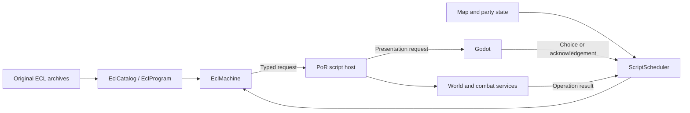

# ECL decoding and execution

Status: the native runtime now includes the PoR research corrections described
below. It executes VM operations and exposes opt-in, resumable engine requests.
Combat, world-state mapping, and a Godot campaign scheduler still need concrete
host implementations. The map demo does not execute cell events.

## Run the implementation

Build and run the self-contained demo (no game assets needed):

```powershell
.\build.cmd
.\build\opengold_scripts.exe --demo
```

The demo computes and prints 12, prompts for CONTINUE or LEAVE, and prints the
zero-based script result, 0 or 1. Console menu labels remain 1 and 2.

For an installed game, set `OPENGOLD_GAME_DIR` to the folder with ECL archives:

```powershell
.\build\opengold_scripts.exe --list "$env:OPENGOLD_GAME_DIR"
.\build\opengold_scripts.exe --inspect "$env:OPENGOLD_GAME_DIR" ECL2.DAX 20
.\build\opengold_scripts.exe --run "$env:OPENGOLD_GAME_DIR" ECL7.DAX 17 4 0x49FB=0
```

The final command is a research invocation with an explicitly initialized
variable. It stops at missing bindings or host capabilities. A successful run
with invented state does not establish original gameplay compatibility. Numbers
accept decimal or `0x` hex, archive names are case-insensitive, and entry slots
are 0..4. The console handles text, menus, number input, and string input; it
does not opt into combat or other engine services. String input needs a fully
bound destination buffer, including its terminator.

`--inspect` marks engine instructions `[host required]` and unresolved execution
`[execution unsupported]`. It follows possible branches, retains decoding
warnings, and reports the originating speculative `ON GOTO` fallthrough when
applicable. A warning makes inspection exit nonzero; it is not proof that the
original game executes that path. `--run` also exits nonzero for faults or EOF
while awaiting input.

## Implemented API

- [`ecl.h`](../src/OpenGold.Formats/include/opengold/ecl.h): shared immutable
  `EclProgram`, instruction/operand types, packed-text decoder and opcode metadata.
- [`ecl_machine.h`](../src/OpenGold.Core/include/opengold/ecl_machine.h):
  `EclCatalog`, `EclMachine`, typed requests, and validated replies.
- [`scripts.cpp`](../tools/scripts.cpp): catalog, disassembler and console runner.
  Link `opengold_core` to embed the runtime.

```cpp
#include <opengold/ecl_machine.h>

void prepare_script(const std::filesystem::path& directory)
{
    using namespace opengold::por;
    const auto catalog = EclCatalog::load(directory);
    const auto program = catalog.find({"ECL2.DAX", 20});
    if (!program) return;
    EclMachine machine(program);
    machine.bind_variable(0xC04F, 1); // Explicit research input: event byte.
    machine.seed_random(1234);      // Reproducible OpenGold sequence.
    // Bind all other required variables and provide real engine services.
    if (!machine.start(1)) return;
    const auto result = machine.run(1000);
    // running: budget yielded; call run() on a later update.
    // waiting: dispatch result.request once, retaining machine between updates.
    // completed/faulted: finish or inspect diagnostic and trace().
}
```

## VM operations

The [source audit](script-source-audit.md) records references, corrections,
contradictions, and the remaining compatibility questions. These are the current
implementation's behaviors, tested with hand-authored bytecode:

| Operations | Runtime behavior |
| --- | --- |
| EXIT, GOTO, GOSUB, RETURN | Direct control flow and bounded stack; empty RETURN falls through. |
| COMPARE and six IF operations | Unsigned numeric or string comparison; false IF skips one decoded instruction. Flags initially all false. |
| COMPARE AND, AND, OR | Equality/inequality flags; ordering flags become false. Bitwise results compare against zero. |
| ADD, SUBTRACT, MULTIPLY, DIVIDE | Unsigned 16-bit arithmetic; SUBTRACT is second minus first. DIVIDE stores the quotient, faults before writing on zero divisor, and does not store a remainder. |
| RANDOM | Seedable MT19937 with portable rejection sampling. The range is 0 through the byte-valued argument, with the increment saturated at 255 (argument 255 therefore yields at most 254). This is not the DOS RNG sequence. |
| SAVE, GETTABLE, SAVE TABLE | Numeric writes, embedded or bound-variable table access, and inline string writes. Table offsets advance one logical address; overflow faults. GETTABLE currently preserves condition flags, pending the source discrepancy in the audit. |
| PRINT, PRINTCLEAR, PRINT RETURN, CLEAR BOX | Text requests; PRINT RETURN emits a blank line and continues. CLEAR BOX requests clearing without adding text. |
| VERTICAL MENU, HORIZONTAL MENU | Zero-based choices; empty menus fault. |
| ON GOTO, ON GOSUB | Zero-based byte selector; selectors at least the list count fall through. |
| PARLAY | Five choices; stores the selected operand value. |
| INPUT NUMBER, INPUT STRING | Resumable validated input, using PC limits of 6 digits and 40 characters. Numbers must fit uint16; empty string input becomes one space. |
| SPELL; unrecognized CALL/PROGRAM service IDs | Explicit PoR no-op behavior. Known CALL/PROGRAM services require a host. |

Operand roles matter. Numeric tags 1/3 read logical cells; encoded addresses in
branch, table-base and destination roles are not dereferenced. String operands
in numeric roles supply their encoded length/address. Text roles expand inline
packed strings (`128`) or bounded NUL-terminated string references (`129`).
`SAVE` with inline text writes the decoded characters and terminator; with a
string reference it writes the reference's numeric address. String destinations
may themselves use tag `129`.

`bind_variable()` and `bind_string()` establish research state while idle or
completed. Program bytes have a private writable copy per machine, including
embedded tables; fetches observe changes and affected instruction spans are
invalidated. The shared catalog remains unchanged. Script space is bounded to
`0x9900..0xB6FF` and the loaded image's actual length. Its cells and the five map
cells `0xC04B..0xC04F` have byte width; other explicit bindings hold 16-bit logical
values. This is not a flat byte array. Reads/writes outside bound or loaded data
fault; string writes validate every destination before changing any of them.

Bindings and RNG state survive completed invocations. `start()` clears the stack
and condition flags and rereads the selected entry from the private script
image. String buffers are at most 255 characters plus a terminator. Budgets limit
work per update, with hard caps of one million instructions per invocation, 256
call frames, and a 64-address trace. Faulted machines require deliberate
reconstruction. Successful earlier instructions are not rolled back after a fault.

## Engine request contract

Every supported engine opcode requires `enable_host(opcode)` before execution.
Without it the VM faults with the opcode name and source PC. Enabling a capability
is the application's promise that it implements that operation; it does not
install a combat system, renderer, or engine-memory adapter.

An `EclRequestKind::host` request carries the original instruction and resolved
`EclHostArgument` values. Each argument is explicitly a number, encoded address,
or text. Opcode-role byte conversions happen before dispatch; raw operand tags
remain available in `instruction`. The host reads implicit fields with
`variable()` and supplies bound-memory changes in `EclHostReply::writes`.

```cpp
// Configure only services actually implemented by this application:
machine.enable_host(0x1D); // PARTY STRENGTH
// After starting/running, for that pending request:
EclHostReply reply;
reply.writes.push_back({request.arguments[0].value, calculated_party_strength});
const bool accepted = machine.resume_host(request.id, reply);
```

`resume(id)` acknowledges text; `resume(id, choice)` answers a menu;
`resume_input(id, text)` answers number/string input. `resume_host(id, reply)`
validates all writes before applying them. Wrong IDs, wrong reply types,
duplicate destinations, missing declared output addresses, and unbound writes
leave the pending request and VM state unchanged. `FIND ITEM` requires its six
condition flags; only the equality pair may be set. Other host replies must not
replace flags. A subsequent `run()` resumes after the completed operation.

`NEW ECL` requires a resolved `next_program` in the reply. It replaces the private
image, clears stack/flags and bound local flags `0x4A00..0x4A1F`, preserves other
bindings, and completes the old invocation. The host supplies previous-script
and world-state changes, then explicitly starts slot 4. It must not resume the
old script after a transition. Program resolution must use the current resource
bank; a numeric script ID alone is insufficient.

| Host opcodes (hex) | Service the application must provide |
| --- | --- |
| 0A, 0B, 0C, 0D, 1C, 36 | Character selection, creature loading, encounter presentation/approach, encounter cleanup, recruitment. |
| 0E, 31, 37 | Picture/sprite presentation and wall-art loading. |
| 1D, 1E, 22, 23 | Party calculations and surprise resolution, including required output writes. |
| 20, 21 | Script replacement and map/resource loading. |
| 24, 27, 28, 29, 2E, 32 | Combat/shop/temple routing, treasure, robbery, encounter menu, damage, inventory search. |
| 2D | Recognized services 2C90, 8000, 8001, BA03, C018, C01E, interpreted by the host. |
| 38, 39, 3A, 3C | Training/win/camp programs, character choice, pacing, rune display. |

The core still lacks a live mapping between engine fields and selected creatures,
party position, time, and inventory. In particular, the character-name address
needs the original special handling when connected to real characters. Updating
a binding alone does not move a party or modify a `CreatureInstance`. Hosts must
validate world mutations before committing and keep VM/world state synchronized.
`0x1F` and the broken `ECL CLOCK` remain explicit execution faults.

## Validation

`build.cmd` runs all three native suites. The ECL suite tests corrected indexing,
condition flags, division, RNG bounds/reproducibility, embedded writable tables,
string references and writes, input validation, host reply atomicity, transitions,
limits, malformed records and independent ownership. Godot's
`tests/ecl_art_tests.gd` tests inspector/review integration and PRINT RETURN
fallthrough.

With `OPENGOLD_GAME_DIR` set, the native suite validates all **29 ECL records** and
runs Slums event 1 from the installed `ECL2.DAX:20` search entry. It checks the
published monster/count/icon sequence, supplies a **mock combat result**, verifies
flag `0x4ACA = 255` and counter `0x4ABB = 1`, then revisits and verifies that the
encounter is not repeated. This validates original bytecode and continuation,
not combat gameplay. No original game data is checked into the tests.

Static inspection still reports seven diagnostics in six programs. Each comes
from a possible indexed-jump fallthrough into embedded table data; the audit
lists their PCs. The inspector retains those paths until range analysis can
prove them impossible. Full campaign execution, original-DOS differential traces,
save/replay and map-event scheduling remain outstanding.

## Full-engine design and remaining work

Build a native, resumable ECL interpreter for the Pool of Radiance DOS release.
Keep binary decoding, script execution, game rules, and presentation separate.
Execute original ECL through explicit OpenGold operations; original machine-code
routines and DOS addresses must never become native calls or pointers.

The first playable milestone is one verified location event that displays text,
accepts a choice, changes a persistent variable, and behaves correctly on revisit.
Full campaign compatibility follows incrementally, with unsupported behavior
reported rather than silently approximated.

## Existing foundations

| Existing component | Reuse and limits |
| --- | --- |
| `decode_dax_archive` in `OpenGold.Formats` | Validates and decompresses DAX containers. Reuse for `ECL*.DAX`. |
| [por_ecl_decoder.gd](../godot/scripts/por_ecl_decoder.gd) | Inspection decoder for typed operands, packed text, five entry jumps, and reachable control flow. Port its tested format knowledge; do not treat static analysis as execution. |
| [por_ecl_tables.gd](../godot/scripts/por_ecl_tables.gd) | Bounded table analysis for asset research. It deliberately stops at uncertain writes/calls and is not a VM. |
| [ECL tests](../tests/ecl_art_tests.gd) | Synthetic format fixtures and installed-data inspection checks. Useful for parity, not independent proof of runtime semantics. |
| `MapCatalog` / `GeoMap` | Map identity, directional geometry, and raw cell event data. No event dispatcher or movement rules yet. |
| `CreatureFactory` | Creates monster/NPC instances with HP and explicit turn budgets. Does not resolve combat, spell effects, or script resource-bank selection. |

Use `opengold::por` for the first implementation. Put decoding in
`OpenGold.Formats` and execution in `OpenGold.Core`, which remains Godot-free.
Keep title-specific address and resource mappings behind a PoR adapter; it can
move into the planned `OpenGold.Game.PoolOfRadiance` target when that target exists.

## Components and ownership

| Proposed type | Responsibility |
| --- | --- |
| `ScriptId` | Canonical archive filename plus record ID; never assume record IDs identify scripts across banks. |
| `EclCatalog` | Load immutable program records from an installation and retain source hashes and diagnostics. |
| `EclProgram` | Own original record bytes, entry table, typed instruction data, and address-to-offset translation. |
| `OpcodeSpec` | Pool-specific operand grammar, control-flow behavior, and execution support status for each opcode. |
| `EclMachine` | Instruction position, return stack, comparisons, script memory, pending request, and bounded execution. |
| `PorScriptMemory` | Checked reads/writes of virtual addresses; explicit bindings to party, map, and engine fields. |
| `PorScriptHost` | Apply typed gameplay requests through world, encounter, resource, and party services. |
| `ScriptScheduler` | Deliver triggers, advance the active machine, and resume it after a matching result. |

Programs are immutable and genuinely shared by catalogs, active machines, and
debugger views through `std::shared_ptr<const EclProgram>`. A campaign session owns
its scheduler, world state, and host by value or `std::unique_ptr`. Stacks,
operands, queues, and memory use standard RAII containers. No owned raw pointers
or file handles survive loading. References to host services are borrowed and
must not outlive the session.

Use one active exploration script invocation per session initially. UI callbacks
enqueue results on the game thread; they never recursively call the interpreter.
Nested ECL subroutine calls use the VM stack. A second machine or nested script
invocation requires evidence that the original behavior needs it.



## Loading and decoding

1. Discover ECL archives case-insensitively, retaining canonical names and bank
   identity. Reject ambiguous filenames, malformed DAX containers, and duplicate
   record IDs. Bound file sizes and allocations as in the existing catalogs.
2. Retain the complete decompressed record. The current PoR decoder removes a
   two-byte prefix and uses virtual code origin `0x9900`. Verify the prefix's
   length convention against installed records before enforcing exact equality.
3. Decode the five initial jump instructions as an entry table. Keep numeric
   entry slots in the format layer; give them gameplay names only in the adapter.
4. Decode reachable instructions and retain undecoded bytes as data. Preserve
   opcode, operand encoding tags, raw virtual addresses, byte spans, and source
   record offsets for diagnostics. Never search arbitrary bytes for opcodes.
5. Validate operand bounds and branch destinations. A target cannot point into
   the middle of a known instruction or operand. A dynamically resolved target
   must be checked and decoded before execution, not assumed to have appeared in
   the static graph. Reject conflicting code/data interpretations in the initial
   implementation and report any original script that requires an exception.

Use one opcode specification for the native decoder, disassembler, and VM.
Separate statuses such as `grammar_known`, `execution_supported`, and
`runtime_verified`. An inspection catalog may retain programs with diagnostics;
execution may proceed only through instructions whose grammar and semantics are
supported. Do not label an entire program compatible merely because it parses.

The current inspection decoder recognizes tags `0`, `1`, `2`, `3`, `0x80`, and
`0x81`, including inline packed six-bit text and address-bearing operands. Its
coarse `memory` label is insufficient for execution: preserve distinctions among
tags and resolve operands according to each opcode's role. In particular, a jump
address must not be accidentally dereferenced as a variable. Specify byte/word
width, signedness, endianness, string bounds, and writable destination rules.

Menus and indexed branches have variable operand lists. Validate their count
encoding independently of execution. Dynamic lengths not yet understood remain
unsupported rather than desynchronizing the instruction stream. Likewise,
conditional skips must advance over one complete decoded instruction, including
variable operands, rather than a fixed number of bytes.

There are known reference discrepancies: our Pool decoder/tests use one operand
for `ECL CLOCK` (`0x34`), while the inspected GBE command registration uses two.
Keep a per-opcode evidence ledger with record offsets, reference revision, tested
grammar, and unresolved semantics. Do not copy another game's table wholesale.

## Virtual memory and game state

ECL addresses are integers in a virtual address space. Storage must distinguish
8-bit script/map cells from 16-bit logical variable cells; it cannot be a plain
64 KiB byte array with uniform addressing. The current implementation uses a
private script image and explicit variable bindings. The future mapped adapter
must retain checked regions and diagnostics for unknown addresses.

Mapped reads and writes go through the PoR adapter. Maintain one authoritative
value for party position, selected character, time, quest state, and similar
fields. Do not maintain an unsynchronized copy in both the VM and world model.
Raw backing bytes may preserve unexplained data for inspection but must not imply
that its gameplay effects have been implemented.

Specify and test arithmetic width, overflow, division by zero, comparison flags,
random bounds, table stride, and string termination before enabling the relevant
operation. Implement explicit integer operations rather than relying on C++
signed overflow. Inject a deterministic RNG; save its algorithm/version and state.

The shared catalog is read-only. The implemented per-machine writable image
supports embedded table writes and invalidates affected instruction spans.
Original self-modifying script behavior still needs differential validation;
working private-image fetches alone do not establish full compatibility.

## Execution and suspension

The following is an API sketch, not a compilable declaration or committed ABI:

```cpp
StartResult start(EntrySlot entry, TriggerContext context);
RunResult run(std::size_t instruction_budget);
ResumeResult resume(RequestId request, HostResult result);
MachineSnapshot snapshot() const;
```

`RunResult` is a tagged value containing one of:

| Result | Scheduler behavior |
| --- | --- |
| `Completed` | Invocation ended; process the next permitted trigger. |
| `AwaitingHost` | Dispatch a typed request once and wait for its result. |
| `BudgetExhausted` | Preserve state and continue on a later update. |
| `Fault` | Stop this invocation and show source context and the execution trace. |

Machine states are idle, running, waiting, completed, and faulted. Each update has
an instruction budget; stack depth, string sizes, request sizes, and trigger queue
length also have bounds. A repeated budget yield keeps the UI responsive and is
not itself a fault. A configurable total invocation limit detects runaway loops
and records a diagnostic rather than hanging forever.

For a host operation, first resolve and validate operands, then store its request
ID and continuation, and suspend. The continuation includes the next instruction
and any validated result destination. Calling `run()` while waiting must not
redispatch or reapply the operation. `resume()` validates the request ID and result
type; duplicate, stale, or mismatched replies leave state unchanged. The current
API separates `resume`, `resume_input`, and `resume_host` for these reply families.

The host validates a mutation before committing it and returns a result in the
original script's value convention. Apply that result exactly once before
continuing. Unsupported opcodes and calls fault with script ID, virtual address,
record offset, raw operands, stack, and trigger context. Previous successful
instructions remain committed: the VM is not an automatic whole-event rollback
system. Debugger replay uses an isolated snapshot to avoid repeating rewards.

## Host requests and Godot integration

Requests and results are typed value objects, preferably `std::variant`, with no
Godot node references inside the VM.

| Request family | Host behavior |
| --- | --- |
| Text, pictures, sprite setup, clear display | Update presentation in script order; acknowledgement semantics are opcode-specific. |
| Choice, number, string, character selection | Pause for input; validate range, encoding, cancellation behavior, and result destination. |
| Resource loading and script replacement | Resolve bank context, stage assets, then commit the requested change. |
| Monster setup and combat | Build encounter definitions, run combat, and return the validated result code. |
| NPC recruitment, inventory, treasure, damage | Delegate to party/world rules, retaining script-visible results. |
| Delay and time queries | Use the game clock, separating game-time advancement from presentation delay. |
| Built-in `CALL` / program operations | Dispatch through an explicit, versioned table of implemented engine services. Unknown service IDs fault. |

`SAVE` and `SAVE TABLE` instruction names must not be confused with saving a game:
their actual variable/table write semantics belong in the opcode specification.

Use a future GDExtension session wrapper to expose advance/resume and immutable
presentation snapshots to Godot. Keep the command-line interpreter harness for
tests and research. The map demo's one-shot JSON subprocess is suitable for
inspection, but should not become the per-instruction gameplay transport.

## Map triggers and transitions

An event number is not an ECL record ID or instruction address. The active area's
script can dispatch through branches or tables and can inspect coordinates,
facing, flags, and party state. Several cells may share an event number while
behaving differently.

The reference entry table suggests normal movement/update, search, pre-camp,
camp-interruption, and startup roles. Preserve that as evidence, not proof of the
exact scheduling conditions. Resolve entry roles and movement timing with a
trace of the original PoR release before connecting general gameplay dispatch.

The proposed flow is: validate a move, commit the appropriate position/time
changes, construct trigger context, invoke the verified entry slot, then process
the resulting requests. The precise order, blocked-move behavior, repeat checks,
and whether an entry runs every exploration update remain adapter policies to
verify. A completed script does not automatically consume or clear a map event.

`TriggerContext` carries map ID, old/new position, facing, trigger kind, raw cell
byte, low-seven-bit event ID, and relevant state revision. Bit 7 has evidence for
an indoor flag; never use it as event-enabled or event-completed state. Event zero
does not justify skipping all area logic. See [MAPS.md](MAPS.md).

While an invocation waits for a menu or combat, pause exploration commands rather
than accumulating clicks as future movement. Queue only explicitly permitted
engine triggers. Validate queued contexts against world/area revisions before
dispatch; discard stale old-area events after a transition.

For `LOAD FILES`, `LOAD PIECES`, and `NEW ECL`, keep map, script, graphics, and
monster-bank context distinct. Do not infer that all record IDs or banks match.
Stage and validate replacement resources before committing a transition. Define
which variables and call frames survive each opcode through evidence; do not
assume a script replacement behaves like a returning subroutine call. Run startup
only where the validated transition rules require it.

## Creature integration

`LOAD MONSTER` supplies separate creature, count, and combat-icon operands in the
existing inspection model. Resolve the creature's archive bank through current
resource context, then call `CreatureFactory::create` for each instance. Store art
selection separately from `CreatureId`, since script-selected artwork can differ.
Stage the whole group before adding it so missing definitions do not create a
partial encounter. Bound counts and diagnose unresolved resource references.

HP generation, surprise, hostility, combat formation, and turn allowances belong
to encounter/combat rules. The factory's stored-max-HP default is not proof of
original encounter HP generation. `SETUP MONSTER`, combat monster loading, and
`ADD NPC` have different purposes; do not assume one automatically performs the
others. Recruitment must resolve which existing or new instance is transferred
to party ownership and preserve its live state according to validated behavior.

## Persistence and debugging

A session snapshot includes asset identities/hashes, compatibility-profile
version, active program, PC, return stack, comparison state, mutable VM regions,
resource context, pending request/continuation, trigger context/queue, RNG state,
and persistent world/party/encounter state. Store IDs and values, never native
pointers. Restore only against matching assets and supported snapshot versions.

Permit saves initially at defined boundaries: idle or waiting on a supported
serializable request. An interrupted combat is not resumable until combat state
has its own snapshot contract. Pending UI requests are reconstructed on load;
completed mutations are not reissued. This provides OpenGold saves, not automatic
compatibility with original DOS save files.

Extend the map review tool with a read-only script inspector: candidate programs
that reference a map, decoded entry points, relevant branch/table evidence, and
dialogue previews. Clearly distinguish proven dispatch from static candidates.
Then add an explicit isolated-session runner with step, continue, breakpoints,
memory watches, and a bounded trace. Clicking a cell must not silently execute
its script against the user's campaign state.

## Delivery sequence and acceptance criteria

| Stage | Deliverable | Acceptance |
| --- | --- | --- |
| 1. Format and evidence | Native ECL catalog, opcode grammar, disassembler, support report | Synthetic fixtures cover all supported encodings; installed archive inventory reports every record and diagnostic. Compare with existing inspector without assuming it is infallible. |
| 2. Pure execution | Variables, arithmetic, comparisons, branching, subroutines, table access, deterministic RNG | Hand-authored programs produce expected state and traces; bounds, divide errors, stack errors, conditional skips, and budget yields behave predictably. |
| 3. Resumable host | Text, menus, typed requests/results, save boundaries | Fake host proves pause/resume, result validation, no duplicate side effects, and deterministic save/reload. Godot shows the same request sequence. |
| 4. One real event | Verified map-to-program dispatch and a persistent choice | Match original-game entry, text, choices, flag changes, revisit behavior, and save/reload for one documented location. Label unimplemented reachable paths explicitly. |
| 5. Area changes and encounters | Resource banks, transitions, factory integration, combat result plumbing | Correct destination/startup order, no stale triggers, distinct creature/art IDs, independent creature HP, and correct result-dependent script continuation. |
| 6. Campaign coverage | Remaining opcodes, services, and compatibility profiles | Publish exercised paths and unresolved behaviors; completing sample events is not a claim of whole-game compatibility. |

Use generated fixtures without proprietary assets in the normal native suite.
Optional installed-data tests should report coverage by script and opcode, not
only a total pass count. Record original-game observations separately from
reference-derived expectations. For each verified event, retain script/map IDs,
coordinates, initial state, actions, outputs, state differences, and game version.

Before stage 4, resolve entry scheduling, mapped-memory addresses, arithmetic and
random conventions needed by that event, resource selection, and input result
codes. Unknown built-in services, one-time event behavior, save persistence, and
script replacement lifetimes are explicit research tasks, not default guesses.

## Evidence and related design

- [Asset source audit](asset-source-audit.md) and
  [NPC art identification](npc-art-identification.md): current static-analysis
  capabilities and limits.
- [Maps](MAPS.md) and [creature API](creature-catalog.md): integration contracts.
- [Gold Box Explorer ECL program decoder](https://github.com/bsimser/Gold-Box-Explorer/blob/eac30abaa6ee66aea6f5d65ebe6d676b10015a8f/src/Common/Plugins/DaxEcl/Program.cs)
  and [command descriptions](https://github.com/bsimser/Gold-Box-Explorer/blob/eac30abaa6ee66aea6f5d65ebe6d676b10015a8f/src/Common/Plugins/DaxEcl/Commands.cs):
  pinned format references, not a complete PoR execution specification.

Later Gold Box games need separate compatibility profiles. Keep generic VM
mechanisms reusable, but require evidence before sharing their opcode meanings,
memory layouts, or gameplay behavior with Pool of Radiance.
